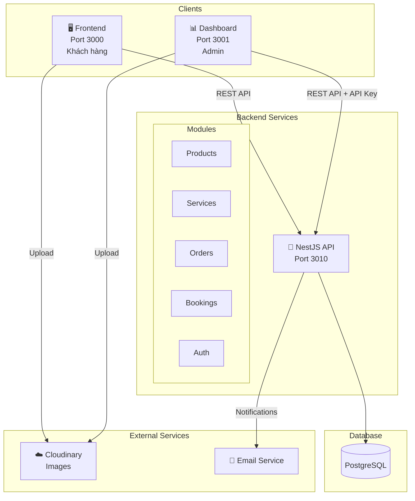
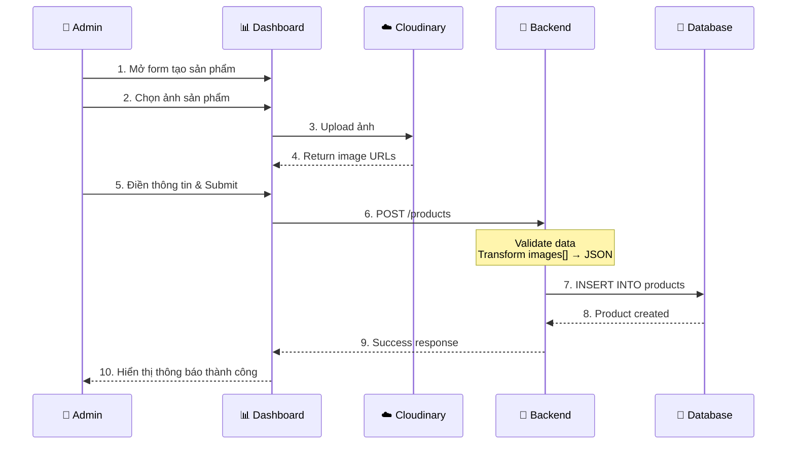
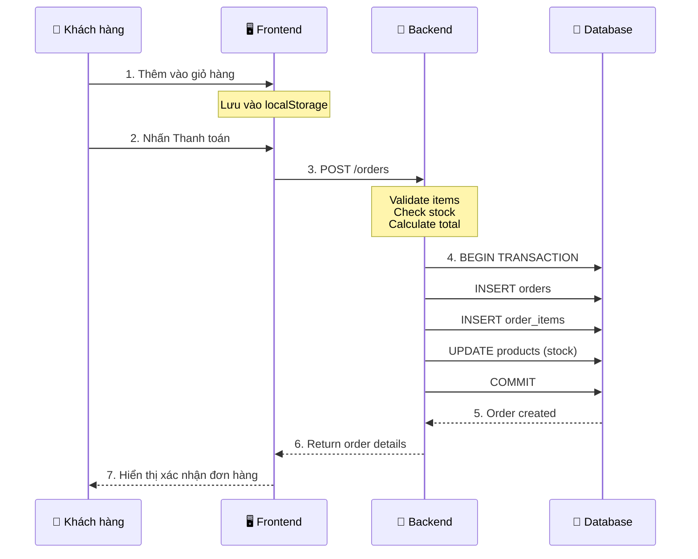
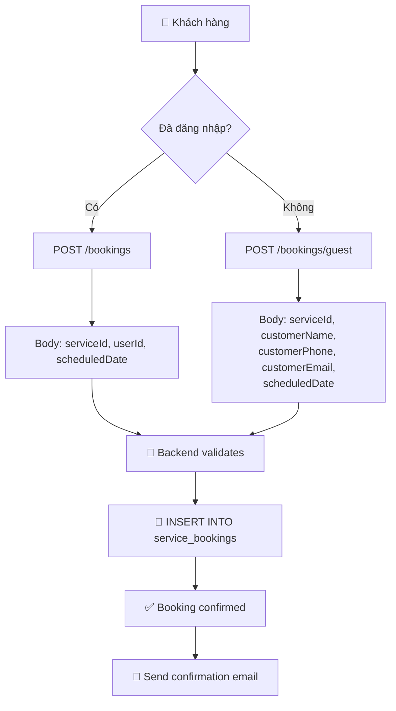
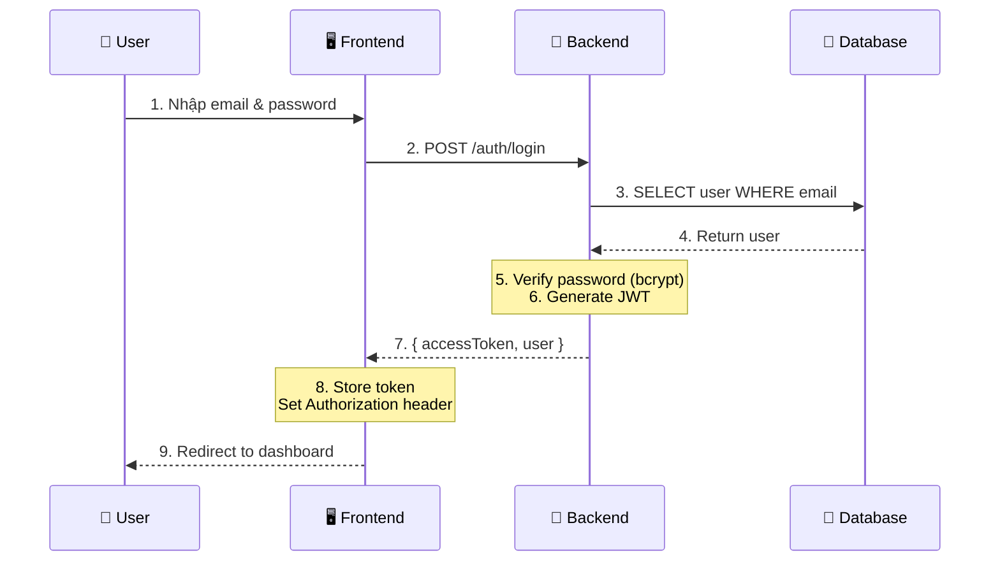
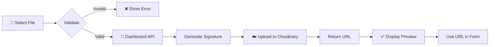
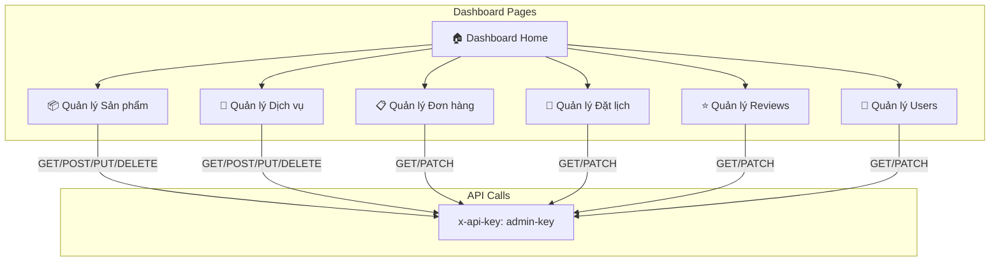
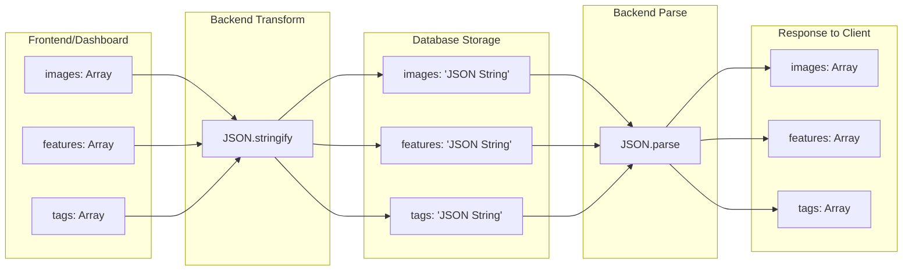
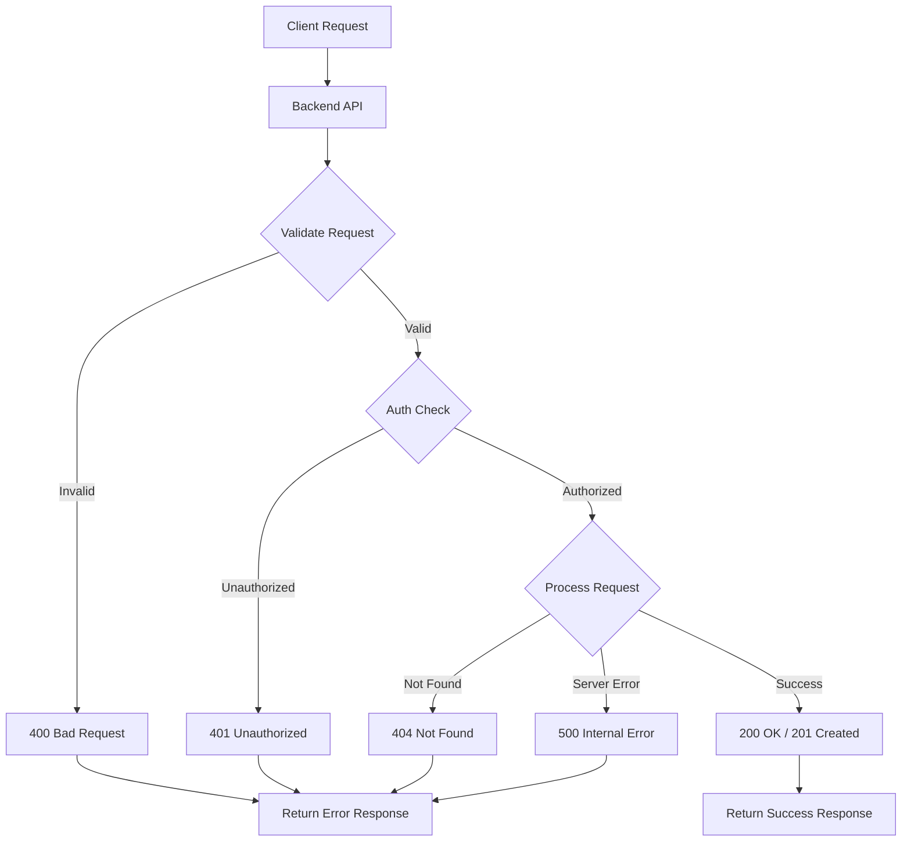
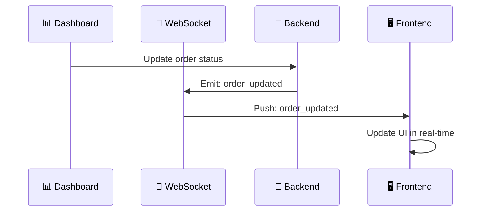

# Audio Tài Lộc - Visual Flow Diagrams

## 1. Tổng quan hệ thống (System Overview)

## 2. Luồng tạo sản phẩm (Product Creation Flow)

## 3. Luồng đặt hàng (Order Flow)

## 4. Luồng đặt lịch dịch vụ (Service Booking Flow)

## 5. Luồng xác thực (Authentication Flow)

## 6. Luồng upload ảnh (Image Upload Flow)

## 7. Dashboard Admin Flow

## 8. Data Transformation Flow

## 9. Error Handling Flow

## 10. Real-time Updates (Future Enhancement)

---

## Summary Tables

### API Authorization Matrix

| Endpoint | Guest | User | Admin |
|----------|-------|------|-------|
| GET /products | ✅ | ✅ | ✅ |
| POST /products | ❌ | ❌ | ✅ |
| GET /orders | ❌ | Own | All |
| POST /orders | ✅ | ✅ | ✅ |
| POST /bookings/guest | ✅ | ✅ | ✅ |
| GET /bookings | ❌ | Own | All |

### Status Flow

| Entity | Status Flow |
|--------|-------------|
| Order | `pending` → `confirmed` → `processing` → `shipped` → `delivered` |
| Booking | `pending` → `confirmed` → `completed` / `cancelled` |
| Review | `pending` → `approved` / `rejected` |
| Product | `draft` → `active` / `inactive` |

---

*Diagrams created with Mermaid.js*
*To view these diagrams, use a Markdown viewer that supports Mermaid*
