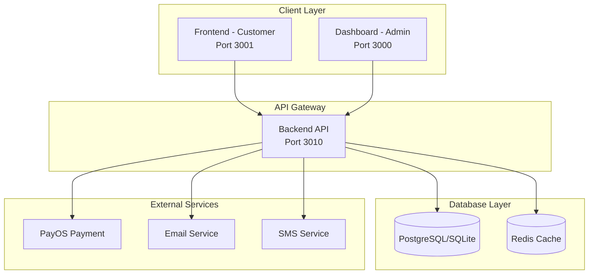

# 🏗️ Audio Tài Lộc - Kiến Trúc & Logic Dự Án

## 📋 Tổng Quan Hệ Thống

### 🎯 Mục Tiêu Dự Án
- **E-commerce Platform** cho thiết bị âm thanh chuyên nghiệp
- **Service Booking** cho dịch vụ lắp đặt, bảo trì
- **Multi-channel Sales** với thanh toán PayOS và COD

### 🔧 Tech Stack
```
Backend:  NestJS + TypeScript + Prisma + PostgreSQL/SQLite
Frontend: Next.js 15 + TypeScript + Tailwind CSS + Shadcn UI
Dashboard: Next.js 14 + TypeScript + Tailwind CSS
Payment:  PayOS (online) + COD (offline)
Auth:     JWT + Refresh Token
State:    Zustand (Frontend) + React Query (Dashboard)
```

## 🏛️ Kiến Trúc Hệ Thống



## 🔄 Business Logic Flow

### 1️⃣ **Customer Journey**

```
Homepage → Browse Products/Services → Product Detail → Add to Cart → Checkout → Payment → Order Success
    ↓           ↓                         ↓              ↓           ↓          ↓
  Login    Categories               Add Wishlist    View Cart    COD/PayOS  Track Order
```

### 2️⃣ **Order Processing Flow**

```
Order Created → Payment Processing → Order Confirmed → Preparing → Shipping → Delivered
      ↓               ↓                    ↓              ↓           ↓          ↓
   PENDING      PENDING/PAID          CONFIRMED      PROCESSING   SHIPPED   DELIVERED
```

### 3️⃣ **Service Booking Flow**

```
Browse Services → Service Detail → Select Date/Time → Book Service → Confirm Booking → Service Completed
       ↓               ↓                  ↓               ↓              ↓                ↓
  By Category    View Details      Check Available    Pay Deposit    Get Reminder    Rate Service
```

## 📁 Module Structure

### Backend Modules (`/backend/src/modules/`)

```
modules/
├── auth/                 # Authentication & Authorization
│   ├── JWT Auth
│   ├── Role Guards (Admin, User, Guest)
│   └── Refresh Token
├── catalog/              # Product Management
│   ├── Products CRUD
│   ├── Categories
│   └── Inventory
├── services/             # Service Management
│   ├── Service CRUD
│   ├── Service Categories
│   └── Service Types
├── orders/               # Order Processing
│   ├── Order Creation
│   ├── Order Status
│   └── Order History
├── payments/             # Payment Processing
│   ├── PayOS Integration
│   ├── COD Management
│   └── Payment Intents
├── cart/                 # Shopping Cart
│   ├── Guest Cart
│   ├── User Cart
│   └── Cart Persistence
├── booking/              # Service Booking
│   ├── Booking Creation
│   ├── Schedule Management
│   └── Booking Status
├── customer/             # Customer Features
│   ├── Reviews
│   ├── Wishlist
│   └── Recommendations
├── admin/                # Admin Functions
│   ├── Dashboard Stats
│   ├── Reports
│   └── Management APIs
└── common/               # Shared Utilities
    ├── Guards
    ├── Interceptors
    ├── Pipes
    └── Decorators
```

### Frontend Routes (`/frontend/app/`)

```
app/
├── (auth)/
│   ├── login/           # Đăng nhập
│   └── register/        # Đăng ký
├── (shop)/
│   ├── products/        # Danh sách sản phẩm
│   │   └── [slug]/      # Chi tiết sản phẩm
│   ├── services/        # Danh sách dịch vụ
│   │   └── [slug]/      # Chi tiết dịch vụ
│   ├── categories/      # Danh mục
│   └── search/          # Tìm kiếm
├── (customer)/
│   ├── cart/            # Giỏ hàng
│   ├── checkout/        # Thanh toán
│   │   └── success/     # Thành công
│   ├── account/         # Tài khoản
│   │   ├── orders/      # Đơn hàng
│   │   ├── profile/     # Thông tin
│   │   └── addresses/   # Địa chỉ
│   └── wishlist/        # Yêu thích
├── (payment)/
│   ├── payment/
│   │   ├── success/     # PayOS success
│   │   └── cancel/      # PayOS cancel
└── (static)/
    ├── about/           # Giới thiệu
    ├── contact/         # Liên hệ
    └── support/         # Hỗ trợ
```

### Dashboard Routes (`/dashboard/app/dashboard/`)

```
dashboard/
├── analytics/           # Thống kê tổng quan
├── products/            # Quản lý sản phẩm
├── services/            # Quản lý dịch vụ
├── orders/              # Quản lý đơn hàng
├── customers/           # Quản lý khách hàng
├── inventory/           # Quản lý kho
├── bookings/            # Quản lý booking
├── payments/            # Quản lý thanh toán
├── reports/             # Báo cáo
└── settings/            # Cài đặt
```

## 🔐 Authentication & Authorization

### User Roles
```typescript
enum Role {
  ADMIN = 'ADMIN',      // Full access
  STAFF = 'STAFF',      // Limited admin access
  USER = 'USER',        // Customer
  GUEST = 'GUEST'       // Unauthenticated
}
```

### Permission Matrix
| Feature | GUEST | USER | STAFF | ADMIN |
|---------|-------|------|-------|-------|
| Browse Products | ✅ | ✅ | ✅ | ✅ |
| Add to Cart | ✅ | ✅ | ✅ | ✅ |
| Checkout | ✅ | ✅ | ✅ | ✅ |
| View Orders | ❌ | Own | All | All |
| Manage Products | ❌ | ❌ | Read | Full |
| Manage Orders | ❌ | ❌ | Update | Full |
| System Settings | ❌ | ❌ | ❌ | ✅ |

## 💳 Payment Logic

### Payment Flow
```
1. Order Creation
   └── Generate Order ID
   
2. Payment Method Selection
   ├── COD: Mark as PENDING → Confirm Order
   └── PayOS: Create Payment Intent
   
3. PayOS Payment
   ├── Redirect to PayOS
   ├── Customer pays
   └── Return to site
   
4. Payment Verification
   ├── Success: Mark PAID → Process Order
   └── Failed: Keep PENDING → Allow Retry
   
5. Order Fulfillment
   └── Ship → Deliver → Complete
```

### Payment States
```typescript
enum PaymentStatus {
  PENDING = 'PENDING',     // Chờ thanh toán
  PAID = 'PAID',          // Đã thanh toán
  FAILED = 'FAILED',      // Thanh toán thất bại
  REFUNDED = 'REFUNDED',  // Đã hoàn tiền
  CANCELLED = 'CANCELLED' // Đã hủy
}
```

## 📊 Data Models

### Core Entities
```typescript
// User
User {
  id: string
  email: string
  name: string
  role: Role
  isActive: boolean
}

// Product
Product {
  id: string
  name: string
  slug: string
  priceCents: number
  categoryId: string
  stockQuantity: number
  isActive: boolean
}

// Order
Order {
  id: string
  orderNumber: string
  userId?: string
  guestEmail?: string
  totalCents: number
  status: OrderStatus
  paymentMethod: PaymentMethod
  paymentStatus: PaymentStatus
}

// Service
Service {
  id: string
  name: string
  slug: string
  basePriceCents: number
  estimatedDuration: number
  categoryId: string
  isActive: boolean
}

// Booking
Booking {
  id: string
  serviceId: string
  userId?: string
  scheduledDate: DateTime
  status: BookingStatus
  totalPriceCents: number
}
```

## 🔄 State Management

### Frontend (Zustand)
```typescript
// Store Structure
├── authStore       // User authentication
├── cartStore       // Shopping cart
├── productStore    // Products & categories
├── serviceStore    // Services
├── orderStore      // Orders
└── uiStore        // UI state (modals, notifications)
```

### Dashboard (React Query)
```typescript
// Query Keys
├── ['products']           // Product list
├── ['product', id]        // Single product
├── ['orders']             // Order list
├── ['order', id]          // Single order
├── ['analytics']          // Dashboard stats
└── ['customers']          // Customer list
```

## 🚀 API Endpoints

### Public APIs
```
GET  /api/v1/health                    # Health check
GET  /api/v1/catalog/products          # Product list
GET  /api/v1/catalog/products/:slug    # Product detail
GET  /api/v1/services                  # Service list
GET  /api/v1/services/:slug            # Service detail
POST /api/v1/auth/register             # Register
POST /api/v1/auth/login                # Login
```

### Protected APIs (User)
```
GET  /api/v1/cart                      # Get cart
POST /api/v1/cart/items                # Add to cart
POST /api/v1/orders                    # Create order
GET  /api/v1/orders                    # My orders
POST /api/v1/payments/intents          # Create payment
```

### Admin APIs
```
GET  /api/v1/admin/dashboard           # Dashboard stats
GET  /api/v1/admin/orders              # All orders
PUT  /api/v1/admin/orders/:id          # Update order
GET  /api/v1/admin/customers           # All customers
POST /api/v1/admin/products            # Create product
PUT  /api/v1/admin/products/:id        # Update product
```

## 🔒 Security Rules

### API Security
1. **Rate Limiting**: 100 requests/minute per IP
2. **CORS**: Configured for frontend domains only
3. **Helmet**: Security headers enabled
4. **Input Validation**: Class-validator on all DTOs
5. **SQL Injection**: Prisma parameterized queries
6. **XSS Protection**: Input sanitization

### Authentication
1. **JWT Access Token**: 15 minutes expiry
2. **Refresh Token**: 7 days expiry
3. **Password Hashing**: bcrypt with salt rounds 10
4. **Session Management**: Redis for token blacklist

### Payment Security
1. **PayOS Webhook**: Signature verification
2. **Idempotency**: Prevent duplicate payments
3. **Amount Validation**: Server-side price calculation
4. **SSL/TLS**: HTTPS only for production

## 📈 Performance Optimization

### Backend
1. **Database Indexing**: On frequently queried fields
2. **Query Optimization**: Prisma select/include
3. **Caching**: Redis for hot data
4. **Pagination**: Offset-based with limits
5. **Connection Pooling**: Database connections

### Frontend
1. **Code Splitting**: Dynamic imports
2. **Image Optimization**: Next.js Image component
3. **Static Generation**: ISR for product pages
4. **Client Caching**: SWR/React Query
5. **Bundle Size**: Tree shaking, minification

## 🧪 Testing Strategy

### Unit Tests
```bash
# Backend
npm run test:unit      # Service/Controller tests

# Frontend
npm run test          # Component tests
```

### Integration Tests
```bash
# Backend
npm run test:e2e      # API endpoint tests
```

### E2E Tests
```bash
# Playwright
npm run test:e2e      # User journey tests
```

## 📝 Deployment Checklist

### Environment Variables
```env
# Backend (.env)
DATABASE_URL=
JWT_ACCESS_SECRET=
JWT_REFRESH_SECRET=
PAYOS_CLIENT_ID=
PAYOS_API_KEY=
PAYOS_CHECKSUM_KEY=
REDIS_URL=

# Frontend (.env.local)
NEXT_PUBLIC_API_URL=
NEXT_PUBLIC_SITE_URL=
```

### Pre-deployment
- [ ] Run tests
- [ ] Build check
- [ ] Database migrations
- [ ] Environment variables
- [ ] SSL certificates
- [ ] Domain configuration

### Post-deployment
- [ ] Health check
- [ ] Payment test
- [ ] Monitor logs
- [ ] Performance check
- [ ] Security scan

## 🔄 CI/CD Pipeline

```yaml
# GitHub Actions
1. Pull Request
   ├── Lint code
   ├── Run tests
   └── Build check

2. Main Branch
   ├── Build images
   ├── Run migrations
   └── Deploy to staging

3. Production
   ├── Tag release
   ├── Deploy to prod
   └── Smoke tests
```

## 📚 Documentation

- **API Docs**: Swagger at `/api/docs`
- **Storybook**: Component library
- **README**: Setup instructions
- **CHANGELOG**: Version history
- **CONTRIBUTING**: Development guide
