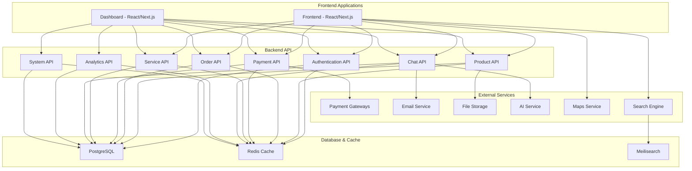
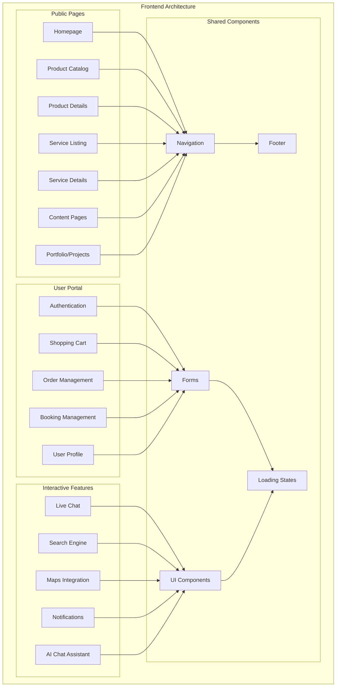
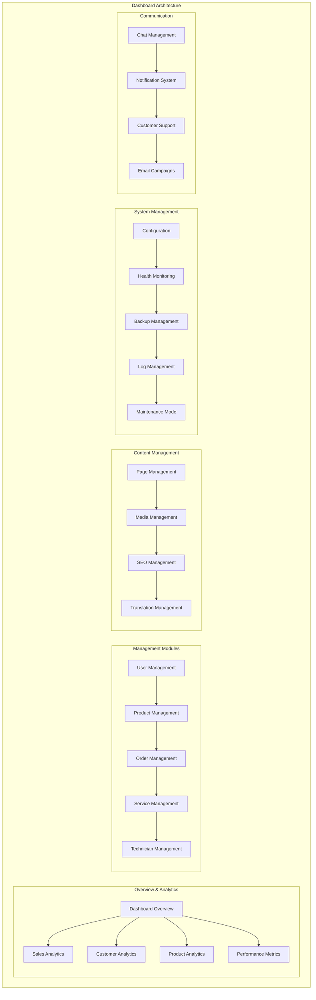
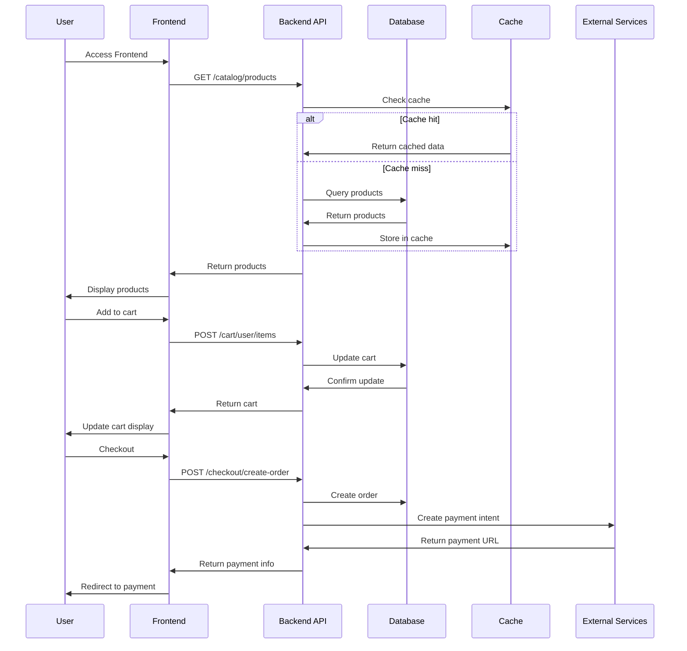
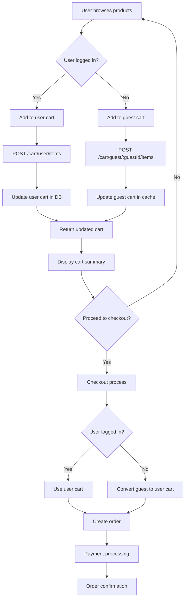
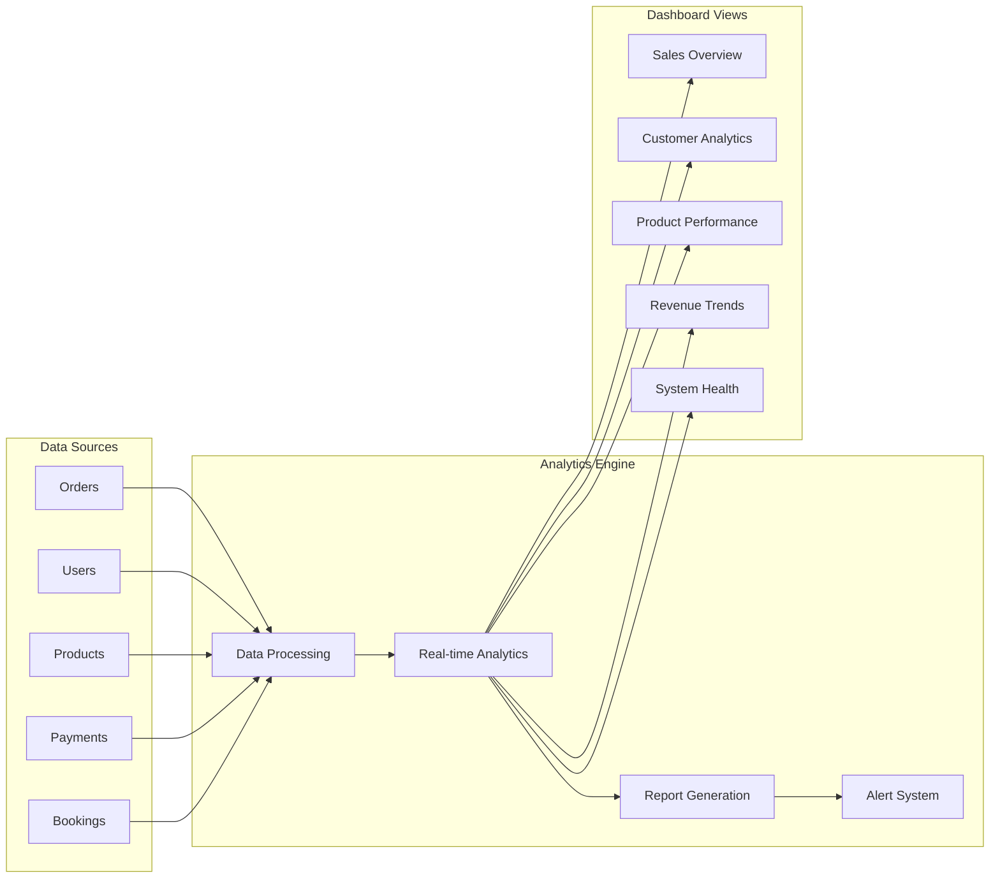
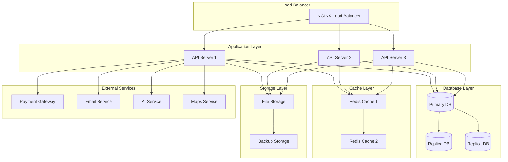

# 🏗️ Sơ Đồ Kiến Trúc - Audio Tài Lộc

## 📊 Sơ Đồ Tổng Quan Hệ Thống

## 🎨 Sơ Đồ Kiến Trúc Frontend

## 🖥️ Sơ Đồ Kiến Trúc Dashboard

## 🔄 Sơ Đồ Luồng Dữ Liệu

## 🔐 Sơ Đồ Authentication Flow

```mermaid
sequenceDiagram
    participant U as User
    participant F as Frontend
    participant B as Backend API
    participant D as Database
    
    U->>F: Login form
    F->>B: POST /auth/login
    B->>D: Verify credentials
    D->>B: User data
    B->>B: Generate JWT tokens
    B->>F: Return tokens
    F->>F: Store tokens
    F->>U: Redirect to dashboard
    
    U->>F: Access protected route
    F->>F: Check token validity
    alt Token valid
        F->>U: Allow access
    else Token expired
        F->>B: POST /auth/refresh
        B->>B: Verify refresh token
        B->>F: New access token
        F->>U: Allow access
    else Token invalid
        F->>U: Redirect to login
    end
```

## 🛒 Sơ Đồ Shopping Cart Flow

## 📊 Sơ Đồ Analytics Dashboard

## 🔧 Sơ Đồ System Architecture

## 🚀 Sơ Đồ Deployment Pipeline

```mermaid
graph LR
    subgraph "Development"
        A1[Code Development]
        A2[Unit Testing]
        A3[Code Review]
    end
    
    subgraph "CI/CD Pipeline"
        B1[Build Process]
        B2[Integration Testing]
        B3[Security Scan]
        B4[Performance Testing]
    end
    
    subgraph "Staging"
        C1[Staging Deployment]
        C2[QA Testing]
        C3[User Acceptance]
    end
    
    subgraph "Production"
        D1[Production Deployment]
        D2[Health Monitoring]
        D3[Performance Monitoring]
        D4[Error Tracking]
    end
    
    A1 --> A2
    A2 --> A3
    A3 --> B1
    B1 --> B2
    B2 --> B3
    B3 --> B4
    B4 --> C1
    C1 --> C2
    C2 --> C3
    C3 --> D1
    D1 --> D2
    D2 --> D3
    D3 --> D4
```

---

## 📋 Sử Dụng Sơ Đồ

### Để xem sơ đồ trong GitHub:
1. Mở file `.md` trong GitHub
2. Sơ đồ Mermaid sẽ tự động render

### Để xem sơ đồ trong VS Code:
1. Cài đặt extension "Mermaid Preview"
2. Mở file `.md`
3. Sử dụng command "Mermaid: Open Preview"

### Để export sơ đồ:
1. Sử dụng Mermaid CLI
2. Export thành PNG, SVG, hoặc PDF
3. Sử dụng trong documentation

---

*Các sơ đồ này cung cấp cái nhìn trực quan về kiến trúc hệ thống Audio Tài Lộc.*

