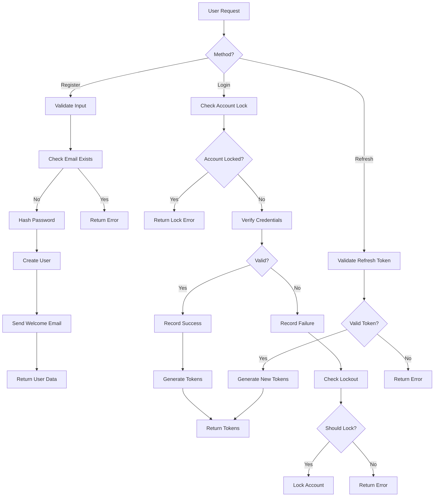
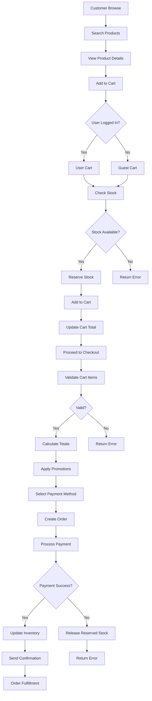
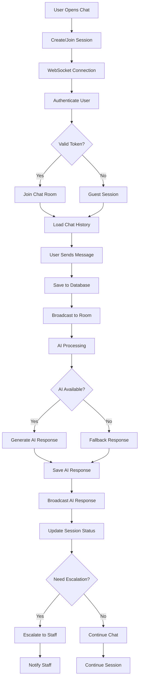
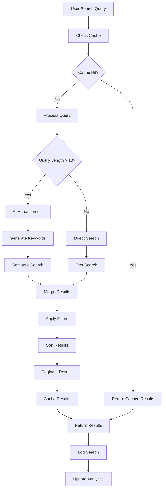
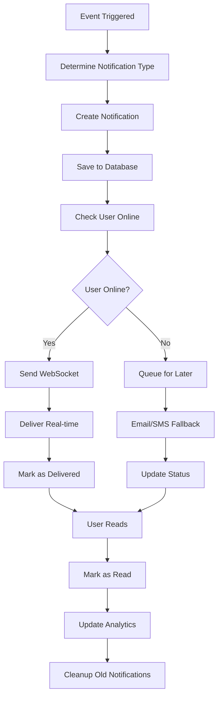
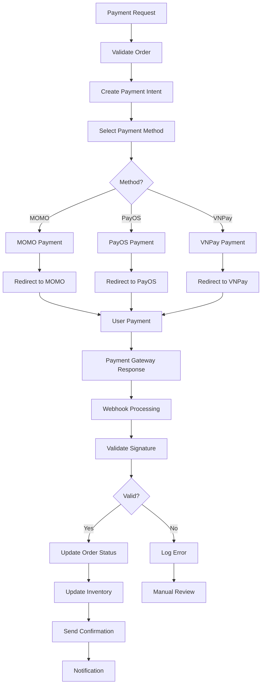
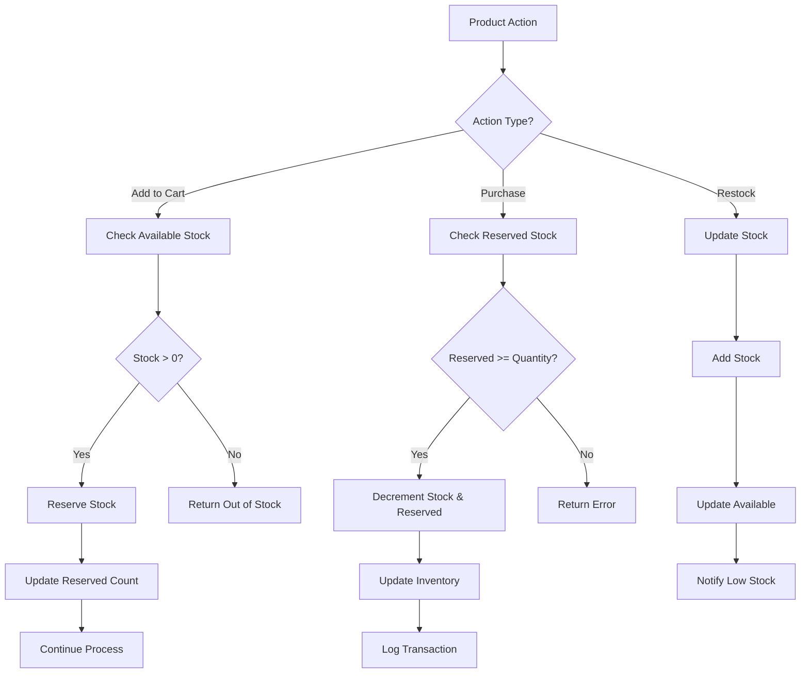
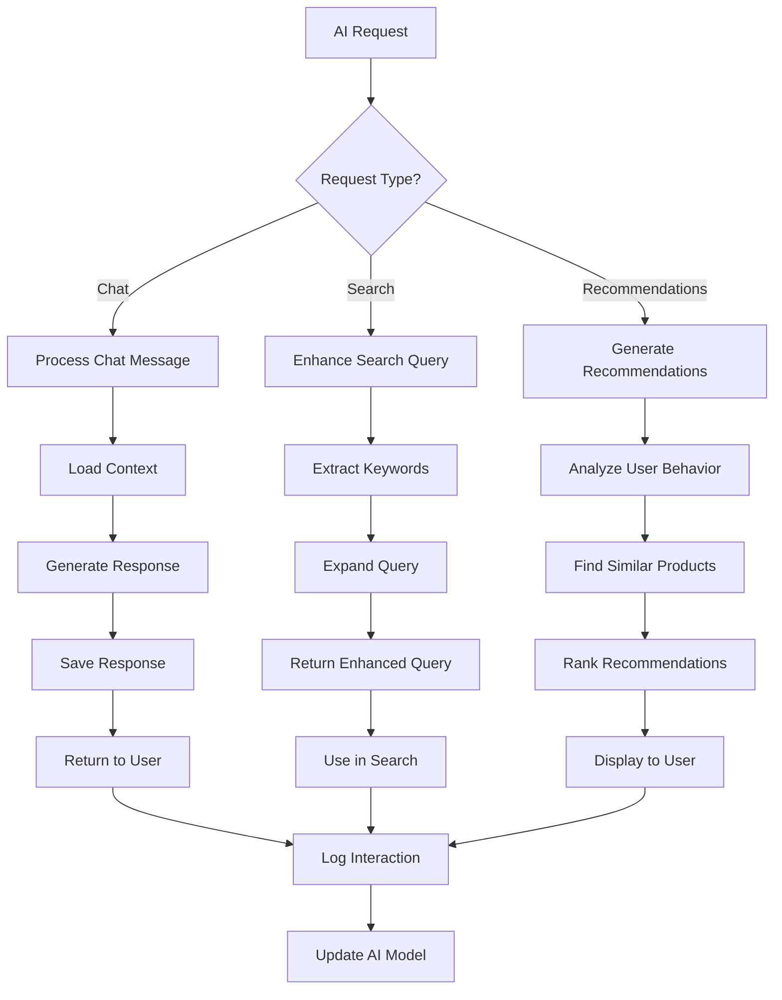
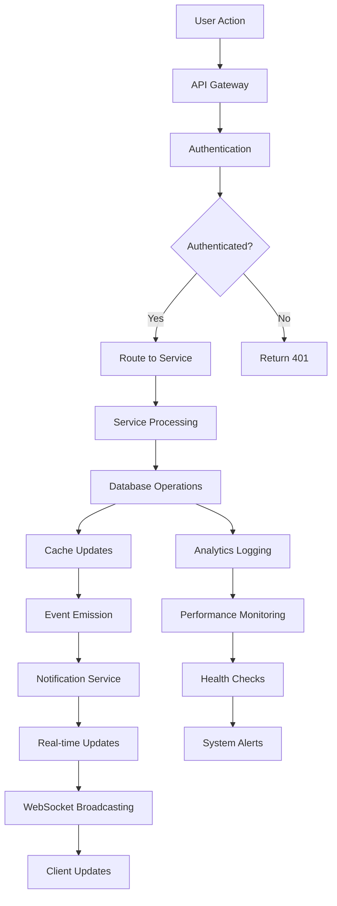

# Backend Flow Diagram - Audio Tài Lộc

## 📋 Mục lục
1. [Authentication Flow](#authentication-flow)
2. [E-commerce Flow](#e-commerce-flow)
3. [Chat System Flow](#chat-system-flow)
4. [Search System Flow](#search-system-flow)
5. [Notification System Flow](#notification-system-flow)
6. [Payment Processing Flow](#payment-processing-flow)
7. [Inventory Management Flow](#inventory-management-flow)
8. [AI Integration Flow](#ai-integration-flow)

---

## 🔐 Authentication Flow

### Chi tiết Authentication:

1. **Registration Process**
   - Validate email format và password strength
   - Check email uniqueness
   - Hash password với bcrypt (salt rounds: 12)
   - Create user record
   - Send welcome email

2. **Login Process**
   - Check account lockout status
   - Verify credentials
   - Track login attempts
   - Generate JWT tokens (access + refresh)
   - Update last login time

3. **Security Features**
   - Account lockout sau 5 lần thất bại
   - Rate limiting: 3 requests/minute cho register, 5 cho login
   - JWT token expiration: 15 phút (access), 7 ngày (refresh)

---

## 🛒 E-commerce Flow

### Chi tiết E-commerce:

1. **Product Browsing**
   - Search với AI enhancement
   - Filter by category, price, availability
   - Pagination và sorting
   - Cache product listings

2. **Cart Management**
   - Guest cart với session storage
   - User cart với database persistence
   - Stock reservation khi add to cart
   - Real-time price updates

3. **Checkout Process**
   - Address validation
   - Payment method selection
   - Order creation với atomic transaction
   - Inventory update sau payment success

---

## 💬 Chat System Flow

### Chi tiết Chat System:

1. **Session Management**
   - Auto-create session cho guest users
   - Persistent sessions cho logged-in users
   - Session status: OPEN, ESCALATED, CLOSED
   - Session analytics và metrics

2. **AI Integration**
   - Automatic response generation
   - Context awareness từ chat history
   - Product recommendations
   - Fallback khi AI unavailable

3. **Real-time Features**
   - WebSocket connection
   - Typing indicators
   - Message delivery status
   - File sharing support

---

## 🔍 Search System Flow

### Chi tiết Search System:

1. **Query Processing**
   - Input validation và sanitization
   - AI keyword expansion cho queries dài
   - Semantic search với embeddings
   - Multi-language support

2. **Result Optimization**
   - Relevance scoring
   - Filtering by category, price, availability
   - Sorting options: relevance, price, date
   - Pagination với configurable page size

3. **Performance Features**
   - Redis caching với TTL
   - Database query optimization
   - Search analytics tracking
   - Result ranking improvements

---

## 🔔 Notification System Flow

### Chi tiết Notification System:

1. **Notification Types**
   - Order updates (confirmation, status changes)
   - Payment confirmations
   - Chat messages
   - System alerts
   - Promotional notifications

2. **Delivery Channels**
   - WebSocket (real-time)
   - Email (fallback)
   - SMS (optional)
   - Push notifications (future)

3. **Management Features**
   - Read/unread tracking
   - Notification preferences
   - Bulk operations
   - Analytics và reporting

---

## 💳 Payment Processing Flow

### Chi tiết Payment Processing:

1. **Payment Methods**
   - MOMO (mobile money)
   - PayOS (bank transfer)
   - VNPay (credit card)
   - Cash on delivery

2. **Security Features**
   - Webhook signature validation
   - Payment intent tracking
   - Duplicate payment prevention
   - Fraud detection

3. **Error Handling**
   - Payment failure recovery
   - Order status rollback
   - Manual review process
   - Customer notification

---

## 📦 Inventory Management Flow

### Chi tiết Inventory Management:

1. **Stock Tracking**
   - Available stock (actual inventory)
   - Reserved stock (in carts)
   - Low stock alerts
   - Stock movement history

2. **Reservation System**
   - Auto-reserve khi add to cart
   - Release reservation khi remove
   - Timeout reservations
   - Prevent overselling

3. **Monitoring**
   - Real-time stock updates
   - Low stock notifications
   - Stock movement analytics
   - Inventory value tracking

---

## 🤖 AI Integration Flow

### Chi tiết AI Integration:

1. **Chat AI**
   - Context-aware responses
   - Product knowledge integration
   - Multi-language support
   - Sentiment analysis

2. **Search Enhancement**
   - Query expansion
   - Semantic understanding
   - Related terms generation
   - Search result ranking

3. **Recommendations**
   - Collaborative filtering
   - Content-based filtering
   - Real-time personalization
   - A/B testing support

---

## 🔄 System Integration Flow

### Chi tiết System Integration:

1. **Request Flow**
   - API Gateway routing
   - Rate limiting
   - Request validation
   - Response transformation

2. **Data Flow**
   - Database transactions
   - Cache synchronization
   - Event-driven architecture
   - Real-time updates

3. **Monitoring**
   - Health checks
   - Performance metrics
   - Error tracking
   - System alerts

---

## 📊 Performance Metrics

### Response Times
- **API Endpoints**: < 200ms
- **Database Queries**: < 100ms
- **Cache Hits**: < 10ms
- **WebSocket Messages**: < 50ms

### Throughput
- **Concurrent Users**: 1000+
- **Requests/Second**: 500+
- **WebSocket Connections**: 500+
- **Database Connections**: 50+

### Availability
- **Uptime**: 99.9%
- **Error Rate**: < 0.1%
- **Recovery Time**: < 5 minutes
- **Backup Frequency**: Daily

---

## 🛡️ Security Measures

### Authentication
- JWT tokens với expiration
- Refresh token rotation
- Account lockout protection
- Rate limiting

### Data Protection
- Input validation
- SQL injection prevention
- XSS protection
- CSRF protection

### Infrastructure
- HTTPS enforcement
- CORS configuration
- Security headers
- Environment isolation

---

*Flow diagrams generated for Audio Tài Lộc Backend System*
*Last updated: ${new Date().toISOString()}*
